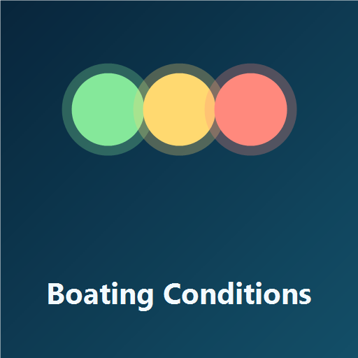

# Boating Conditions

Daylight-only Friday, Saturday, and Sunday boating guidance for the nearest upcoming weekend at Brighton Marina.

This custom integration:

- fetches Open-Meteo weather and marine forecasts
- scores comfort and handling for a 55 ft motor yacht
- publishes Friday, Saturday, Sunday, and overall weekend RAG sensors
- includes a bundled custom Lovelace card served directly by the integration

Green means easy and pleasant, yellow means safe but a bit lumpier or more demanding, and red means uncomfortable or challenging conditions for a local boating day.

See the README for installation, dashboard setup, and notification examples.
